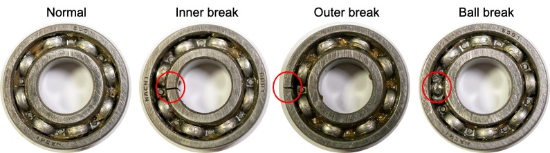
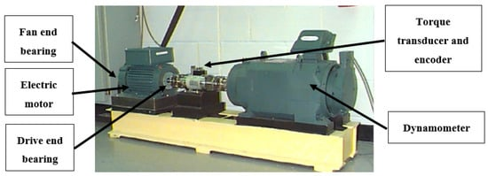
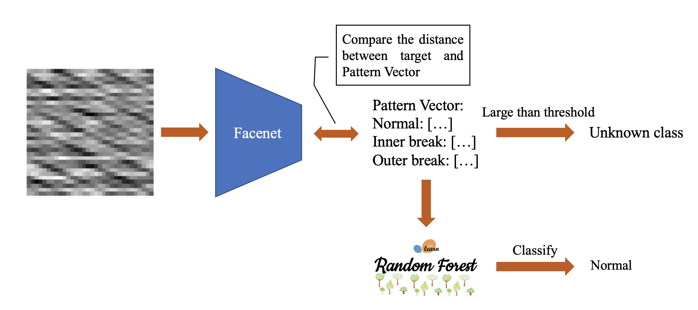
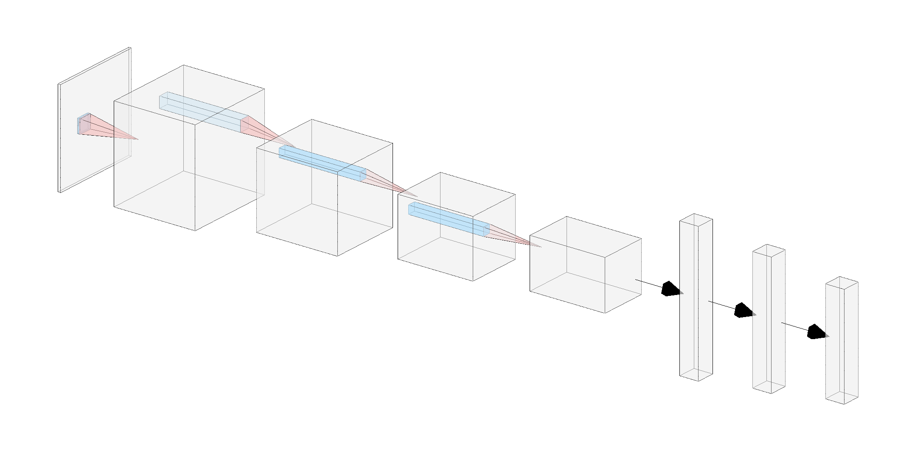
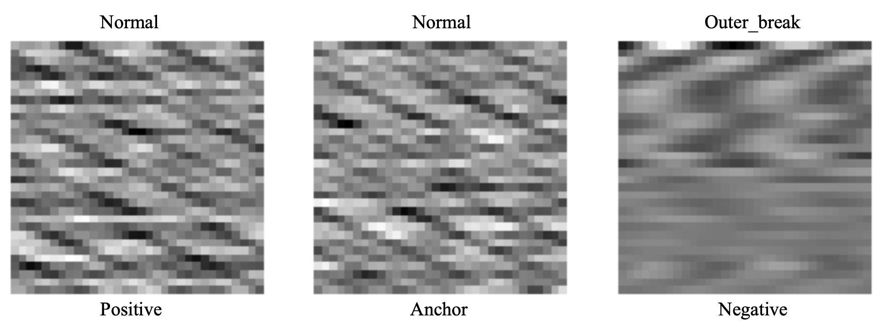
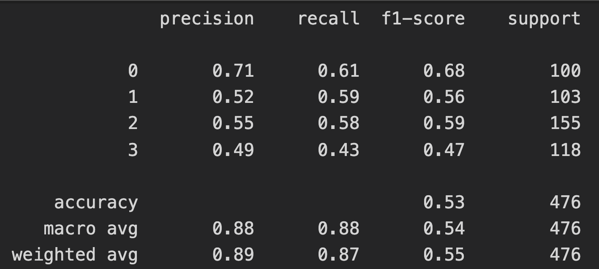

# Bearing Fault dataset

## Specification(Only choose the data like below)

1. The dataset contain 4 class(Normal, Inner break, Outer break, ball break):

   
   
2. Motor Speed: <font color=#FF6600>1750 rpm</font>

3. Fault Diameter: 0.021(cm)

4. Collect in <font color=#FF6600>drive end</font>

## Device for data collection



## Data Source

[Case Western Reserve University - Bearing Data Center](https://csegroups.case.edu/bearingdatacenter/home)

# Algorithm

## Outline



## Facenet for bearing fault dataset

1. Specification:
   - Sructure
     
   - Optimizer:
     Adam(lr = 0.001, l2 decay = 0.001)
   - Loss function: Triplet loss
2. Training step:
   - Input Anchor, Positive, and Negative image to the model:
     
   - Update the parameters by triplet loss

## Random Forest for bearing fault dataset

```python
# The parameter for random forest
RF = RandomForestClassifier(
		n_estimators=150, criterion='gini', 
		max_depth=7, min_samples_split=2, 
		min_samples_leaf=1, min_weight_fraction_leaf=0.0, 
		max_features='sqrt', max_leaf_nodes=None, 
		min_impurity_decrease=0.1, min_impurity_split=None, 
		bootstrap=True, oob_score=False, 
		n_jobs=16, random_state=None, 
		class_weight=None, ccp_alpha=0.0
)
```

## Benchmark(0: Normal, 1: Inner break, 2: Outer break, 3: Unknown[Ball]):
### Total report:



